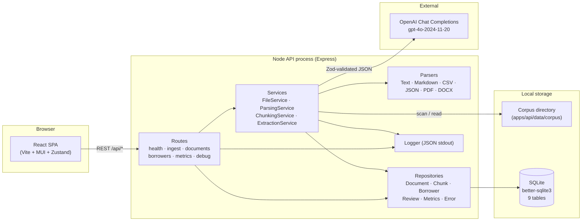
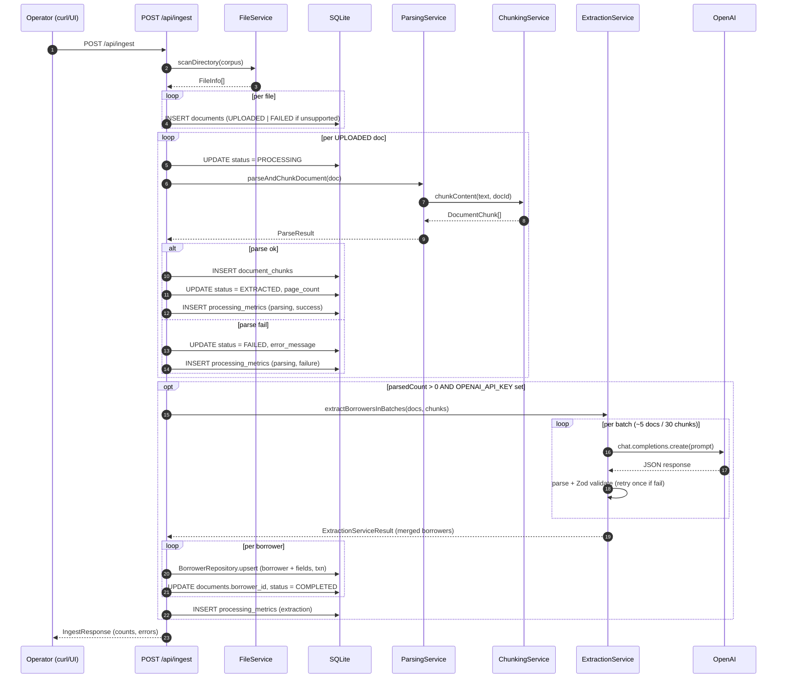
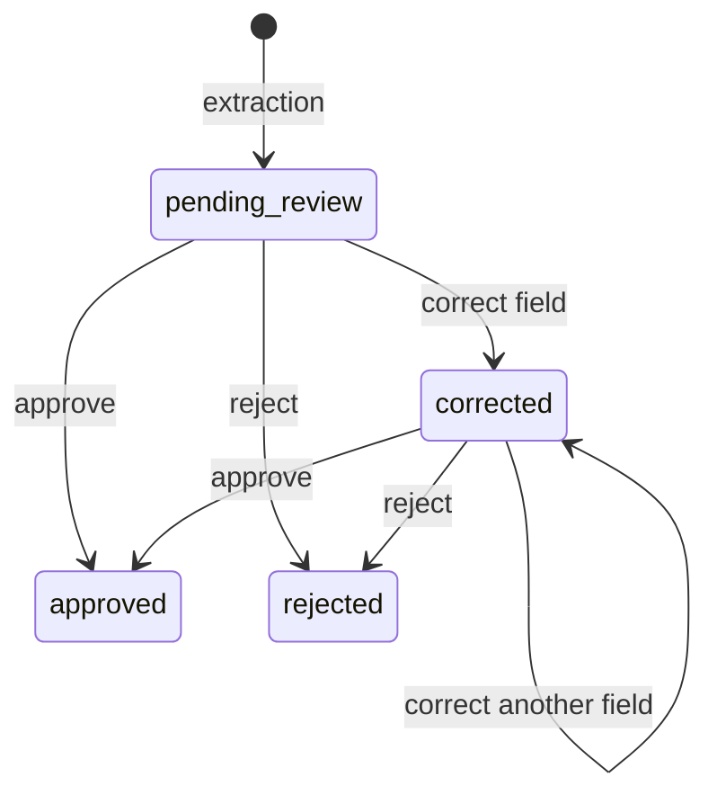

# LoanLens System Design

**Last Updated:** 2026-05-09
**Version:** 0.1.0
**Status:** Phase 6.5 (human review) complete; ingestion → parsing → LLM extraction → review pipeline operational.

This document is the architecture-level companion to
[`PROMPT_STRATEGY.md`](./PROMPT_STRATEGY.md). It describes how the ingestion,
extraction, storage, and review subsystems fit together, the trade-offs
behind each, and how the current single-node design evolves at 10x and 100x
volume.

---

## Table of Contents

1.  [Architecture Overview](#1-architecture-overview)
2.  [Component Diagram](#2-component-diagram)
3.  [Data Pipeline](#3-data-pipeline)
4.  [Ingestion Strategy](#4-ingestion-strategy)
5.  [Parsing Strategy](#5-parsing-strategy)
6.  [LLM Extraction Strategy](#6-llm-extraction-strategy)
7.  [Storage Design](#7-storage-design)
8.  [Retrieval Design](#8-retrieval-design)
9.  [Handling Document Variability](#9-handling-document-variability)
10. [Scaling to 10x Volume](#10-scaling-to-10x-volume)
11. [Scaling to 100x Volume](#11-scaling-to-100x-volume)
12. [Technical Trade-offs](#12-technical-trade-offs)
13. [Error Handling](#13-error-handling)
14. [Validation and Data Quality](#14-validation-and-data-quality)
15. [Observability](#15-observability)
16. [Human Review Workflow](#16-human-review-workflow)
17. [Future Improvements](#17-future-improvements)

---

## 1. Architecture Overview

LoanLens is a TypeScript monorepo (npm workspaces) with three packages:

| Package                        | Role                                                          |
| ------------------------------ | ------------------------------------------------------------- |
| `apps/api` (Express)           | REST API, ingestion/extraction pipeline, SQLite persistence.  |
| `apps/web` (React + Vite + MUI)| Operator UI: documents, borrowers, evidence, review queue.    |
| `packages/domain`              | Shared TypeScript types, Zod-derived domain schemas, enums.   |

The system is a **single-node, synchronous pipeline**:

- The API process owns the SQLite database (`better-sqlite3`).
- Ingestion (`POST /api/ingest`) is a request-scoped task that walks a
  corpus directory, parses each document, runs LLM extraction in batches,
  and persists borrowers — all within one HTTP request.
- The web app is a SPA backed by REST endpoints; no server-rendered routes.
- The only external dependency is OpenAI (`gpt-4o-2024-11-20`), called from
  `ExtractionService`.

This shape is intentional for v0.1: it minimizes moving parts and lets us
treat the entire pipeline as a deterministic, debuggable function from
"directory of files" to "rows in `borrowers` and `borrower_fields`." The
[scaling sections](#10-scaling-to-10x-volume) describe the staged path to a
queue/worker topology.

---

## 2. Component Diagram



Key boundaries:

- **Routes** are thin orchestrators; they own request validation and
  response shaping but delegate domain work to services.
- **Services** are stateless; they receive a `Database` handle (or repo
  instances) and the domain inputs they need.
- **Repositories** are the only code that issues SQL. Other code talks to
  domain types.
- **Parsers** implement a single `IParser` interface so the parsing service
  can dispatch by file extension.

---

## 3. Data Pipeline

The end-to-end flow for a single ingest invocation:



Status transitions a document can take:
`UPLOADED → PROCESSING → EXTRACTED → COMPLETED` on the happy path, with
`FAILED` reachable from `UPLOADED` or `PROCESSING`. The `QUEUED` and
`ANALYZING` states are reserved for the future async pipeline (see
[§10](#10-scaling-to-10x-volume)).

---

## 4. Ingestion Strategy

**v0.1 model: directory scan, not user upload.**

`POST /api/ingest` recursively walks `apps/api/data/corpus/` via
`FileService.scanDirectory()`, classifies each file by extension against an
allow-list of MIME types (`.txt`, `.csv`, `.md`, `.json`, `.pdf`, `.docx`),
and creates one `documents` row per file:

- **Supported**: status = `UPLOADED`, ready for parsing.
- **Unsupported**: status = `FAILED`, `error_message = "Unsupported file
  type: <ext>"`. Recorded so reviewers see what was skipped.

Why directory-scan instead of multipart upload?

- The supplied `Loan Documents/` corpus is the unit of work for the project
  brief. Treating it as the source of truth removes a class of upload-time
  edge cases (concurrent writes, partial uploads, antivirus, MIME spoofing)
  that aren't on the critical path for a v0.1 demo.
- It keeps the demo loop fast: drop files into the corpus, hit ingest, see
  borrowers.
- The schema is upload-ready: `mime_type`, `file_size`, and `storage_path`
  columns make swapping in a multipart endpoint a route-level change, not a
  data-model change.

Idempotency is **not** implemented in v0.1: re-running ingest on the same
corpus creates duplicate `documents` rows. A `unique(filename, file_size,
content_hash)` constraint or content-hash dedup is on the [improvements
list](#17-future-improvements).

---

## 5. Parsing Strategy

`ParsingService` owns format dispatch via an array of `IParser`
implementations:

| Parser          | Library       | Notes                                                |
| --------------- | ------------- | ---------------------------------------------------- |
| `TextParser`    | node `fs`     | Pass-through.                                        |
| `MarkdownParser`| node `fs`     | Pass-through (preserves headings as plain text).     |
| `CsvParser`     | hand-rolled   | Tabular text, header-aware.                          |
| `JsonParser`    | `JSON.parse`  | Pretty-printed for readability in chunks.            |
| `PdfParser`     | `unpdf`       | Page-aware: emits `[Page N]\n<text>` markers.        |
| `DocxParser`    | `mammoth`     | Extracts text; ignores formatting.                   |

Each parser implements:

```ts
interface IParser {
  canParse(filePath: string): boolean;
  parse(filePath: string): Promise<string>;
}
```

The first parser whose `canParse()` returns true wins. Parsers throw on
unrecoverable errors; `ParsingService` wraps the throw in a
`ParseResult { success: false, error }` so the caller can keep the
ingestion loop running.

After parsing, `ChunkingService` splits content into sentence-aware,
overlapping chunks (~1500 chars, 100-char overlap). Chunking decisions and
their rationale are documented in detail in
[`PROMPT_STRATEGY.md` §3](./PROMPT_STRATEGY.md#3-why-chunking-is-used).

Chunks are persisted with `page_number`, `chunk_index`, and `extracted_at`
so the UI can render them in source order with page anchors.

**Known parsing gaps** (called out in the limitations section so they are
not silently assumed to work):

- No OCR for image-based PDFs; `unpdf` returns empty text and the document
  ends up as `EXTRACTED` with zero useful chunks.
- `pageNumber` defaults to `1` for non-PDF parsers — page-level provenance
  is only meaningful for PDFs today.
- Tables in PDFs are flattened to text; cell structure is lost.

---

## 6. LLM Extraction Strategy

The full prompt design, JSON enforcement, validation, retry, and
hallucination mitigations live in
[`PROMPT_STRATEGY.md`](./PROMPT_STRATEGY.md). The system-design-relevant
points:

- **Service**: `ExtractionService` (`apps/api/src/services/ExtractionService.ts`).
- **Model**: `gpt-4o-2024-11-20`, temperature 0.1, max_tokens 16k,
  configured via `OPENAI_API_KEY` / `OPENAI_MODEL` env vars.
- **Batching**: `extractBorrowersInBatches()` partitions documents into
  batches of `≤5 docs / ≤30 chunks / ≤40K chars` to fit context and
  per-minute rate limits.
- **Inter-batch delay**: 2 seconds between batches.
- **Validation**: every response is `JSON.parse`d, then validated by
  `OpenAIExtractionResponseSchema` (Zod). Failures get one retry with the
  prior error message embedded in the prompt.
- **Rate-limit retry**: separate exponential-backoff retry (5s, 10s, 20s)
  on HTTP 429 from OpenAI.
- **Cross-batch merge**: `mergeDuplicateBorrowers()` keys on SSN with
  full-name fallback and prefers higher-confidence values on collision.
- **Persistence**: borrowers and their fields are written via
  `BorrowerRepository.upsert()` inside a transaction, so a partial failure
  cannot leave a half-saved borrower.

The route layer (`POST /api/ingest`) tracks per-batch metrics and surfaces
extraction failures in the response without aborting the rest of the
ingestion.

---

## 7. Storage Design

Single SQLite database (`better-sqlite3`), 9 tables. SQLite was chosen for
v0.1 because it gives synchronous transactions, zero infra, and is fast
enough for the project's volume target (≤100K documents).

| Table                    | Purpose                                                       |
| ------------------------ | ------------------------------------------------------------- |
| `documents`              | Document metadata, status, storage path, borrower link.       |
| `document_chunks`        | Chunked text with page numbers and chunk index.               |
| `borrowers`              | Borrower envelope with `review_status`, audit fields.         |
| `borrower_fields`        | EAV rows for every extracted field with full provenance.      |
| `processing_errors`      | Captured exceptions tied to documents/borrowers.              |
| `processing_metrics`     | Per-stage timings and outcomes (parsing, extraction, …).      |
| `extraction_attempts`    | Per-attempt extraction results for retry analysis.            |
| `field_corrections`      | Audit trail of human corrections to extracted fields.         |
| `borrower_review_audit`  | Action log for `approved` / `rejected` / `corrected` events.  |

### 7.1 EAV for Extracted Fields

`borrower_fields` is an Entity-Attribute-Value table keyed on
`(borrower_id, field_name)` with optional `parent_field_id` and
`array_index` for nested structures (addresses, income history). Every row
carries:

```
field_name, field_type, field_value,
confidence, source_document_id, source_page,
evidence_quote, bounding_box, extracted_at, notes
```

Why EAV instead of a wide `borrowers` table:

- Borrower fields are sparse (few fields per document type).
- Provenance metadata applies *per field*, not per borrower — a wide table
  would explode column count.
- New fields are additive: extracting a new attribute from the LLM is a
  prompt change, not a migration.

Cost: queries that need many fields require a join or grouping. The web
layer mitigates this by fetching a borrower's full field set in a single
query (one round trip) and reshaping it into the domain object.

### 7.2 Indexing

Indexes are intentionally narrow:

- `documents`: `borrower_id`, `status`, `uploaded_at`.
- `document_chunks`: `(document_id, page_number)`.
- `borrowers`: `updated_at`, `review_status`.
- `borrower_fields`: `borrower_id`, `(borrower_id, field_name)`,
  `source_document_id`.
- `processing_metrics`: `document_id`, `metric_type`, `started_at`,
  `success`.

These cover the read patterns in [§8](#8-retrieval-design); we add
indexes only when we have a query that needs them.

### 7.3 Transactions

Multi-row writes (especially `BorrowerRepository.create/upsert`, which
touches `borrowers` plus N rows in `borrower_fields`) run inside
`db.transaction(() => ...)`. SQLite's serialized writer model means we
never see torn borrower writes.

---

## 8. Retrieval Design

REST endpoints, all under `/api`:

| Endpoint                                  | Purpose                                          |
| ----------------------------------------- | ------------------------------------------------ |
| `GET /api/health`                         | Liveness + version.                              |
| `POST /api/ingest`                        | Run the full pipeline on the corpus.             |
| `GET /api/documents`                      | Paginated list, filter by status / borrower.     |
| `GET /api/documents/:id`                  | Single doc + linked borrower id.                 |
| `GET /api/documents/:id/chunks`           | Chunks in `chunk_index` order.                   |
| `GET /api/borrowers`                      | Paginated list, free-text search.                |
| `GET /api/borrowers/:id`                  | Borrower with all extracted fields.              |
| `GET /api/borrowers/:id/documents`        | All documents linked to a borrower.              |
| `POST /api/borrowers/extract`             | Manual extraction trigger (no re-ingest).        |
| `POST /api/borrowers/:id/review/*`        | Approve / reject / correct workflow.             |
| `GET /api/metrics/summary`                | Aggregate counts and durations.                  |
| `GET /api/metrics/documents/:id`          | Per-document metric and attempt history.         |

Read-side conventions:

- Pagination via `limit` / `offset` (default 50 / 0).
- Search uses `LIKE '%term%'` over a synthetic concatenation of borrower
  fields. Fine at v0.1 volume; FTS5 is the planned upgrade
  (see [§10](#10-scaling-to-10x-volume)).
- Responses always include source provenance for extracted fields so the
  UI never has to make an extra request to render an evidence quote.

Frontend store layer (`Zustand`) caches list responses per page and
invalidates on review-action mutations.

---

## 9. Handling Document Variability

Mortgage corpora are heterogeneous: every lender ships a different
template, format mix is common (PDF + DOCX + scanned + spreadsheet), and
OCR noise is endemic. Our handling strategy:

1.  **Format-agnostic ingestion.** The parser registry is open: add a new
    parser class, add it to `ParsingService`, no other changes. All
    downstream code works on plain text.
2.  **Sentence-aware chunking with overlap.** Reduces value loss across
    chunk boundaries when a document has irregular line breaks (common in
    OCR'd PDFs).
3.  **LLM as the schema mapper.** The prompt asks the model to extract
    well-known fields regardless of the surface form. We avoid per-template
    regex, which would require ongoing per-lender maintenance.
4.  **Permissive schema with mandatory provenance.** Most borrower fields
    are optional (`fullName` is the only required one). The model is never
    forced to invent missing data, but every field it does extract must
    point at the source text.
5.  **Cross-document merge.** Borrowers commonly appear in multiple
    documents (1003, W-2, bank statements). `mergeDuplicateBorrowers()`
    consolidates them by SSN-then-name with confidence-weighted merging.
6.  **Human-in-the-loop fallback.** Every borrower lands as
    `pending_review`; reviewers can correct any field with full audit.
    Anything the pipeline gets wrong becomes a correction, not a silent
    bug.

Things we explicitly **don't** do today (called out so reviewers know):

- No per-template detection or routing.
- No layout-aware extraction (no bounding boxes, no positional models).
- No OCR (image-only PDFs end up as empty extractions).

---

## 10. Scaling to 10x Volume

Target: ~1M documents, multi-tenant or batch jobs measured in hours
rather than minutes. The single-process design starts to bind in three
places — pipeline latency, OpenAI rate limits, and SQLite write
contention.

| Bottleneck                              | 10x change                                                                  |
| --------------------------------------- | --------------------------------------------------------------------------- |
| Synchronous ingest holds an HTTP request| Move pipeline behind a job queue (BullMQ/Redis or SQS). `POST /api/ingest` enqueues; workers process. |
| One process per node                    | Horizontal API + worker pool behind a load balancer; SQLite stays per-node only for the API read replica. |
| OpenAI per-minute TPM/RPM               | Concurrency cap per worker, token-bucket limiter, batched concurrent calls (Promise.all over batches with cap). |
| `LIKE '%...%'` borrower search          | Migrate borrower search to SQLite FTS5 virtual table (still single-node) or to Postgres `tsvector`. |
| In-process file storage                 | Move corpus to object storage (S3/MinIO) with signed URLs; document `storage_path` becomes an S3 key. |
| Stateful single SQLite file             | Migrate to Postgres for concurrent writers; keep SQLite as test fixture. EAV table maps cleanly. |
| Logs only on stdout                     | Structured logs → centralized sink (Loki/CloudWatch); metrics scraped via `/api/metrics/summary` or Prom exporter. |

What stays:

- Domain types (`packages/domain`) and Zod schemas — Postgres uses the
  same JSON shapes.
- Repository interfaces — swap implementation, keep callers.
- The extraction prompt — model-side scaling is independent of infra
  scaling.

---

## 11. Scaling to 100x Volume

Target: ~10M documents, sustained throughput, multi-tenant SLAs.

| Concern                | 100x architecture                                                                          |
| ---------------------- | ------------------------------------------------------------------------------------------ |
| Pipeline orchestration | Stage-per-service: ingest service, parse service, extract service. Each owns its queue.    |
| Document storage       | Object storage with lifecycle policies; CDN for evidence rendering.                        |
| Hot data               | Redis cache layer for borrower lookups and review-queue snapshots.                         |
| Database               | Postgres with logical sharding by tenant; or a managed OLTP store (Aurora/Spanner).        |
| Search                 | Dedicated search index (OpenSearch/Elastic) populated from a CDC stream off the OLTP store.|
| LLM cost               | Per-tenant prompt caching; cheaper model tier (e.g. gpt-4o-mini) for re-extracts; embedding-based cache for "is this chunk equivalent to one we've seen?". |
| Hallucination control  | Quote-grounding verifier service that asserts every `evidenceQuote` is a substring of its chunk; flag and re-route on mismatch. |
| Multi-region           | Stateless API + workers per region, replicated OLTP, region-pinned object storage.         |
| Compliance             | KMS-managed at-rest encryption, field-level encryption for PII, audit log to WORM storage. |
| Tenancy isolation      | Row-level security or per-tenant schema; per-tenant API keys for OpenAI; per-tenant rate limits.|

The architectural shape at 100x is recognizably the same — REST API,
pipeline, store, review UI — but each box is its own service with its own
SLO, and the LLM call path is the most expensive thing on the page.

---

## 12. Technical Trade-offs

| Decision                                    | Chosen                                  | Alternative                                      | Why                                                                                                |
| ------------------------------------------- | --------------------------------------- | ------------------------------------------------ | -------------------------------------------------------------------------------------------------- |
| Database                                    | SQLite (`better-sqlite3`)               | Postgres                                         | Zero infra; synchronous API simplifies repos; volume target fits.                                 |
| Pipeline shape                              | In-request synchronous                  | Job queue                                        | Faster to build and debug; queue is the obvious 10x upgrade.                                      |
| Field storage                               | EAV (`borrower_fields`)                 | Wide column                                      | Sparse fields, per-field provenance, schema-additive extraction.                                  |
| LLM JSON enforcement                        | Prompt + post-parse Zod                 | OpenAI structured outputs / function calling     | Single source of truth (Zod), retry prompt has full error context.                                |
| Validation                                  | Zod (runtime)                           | TypeScript types only                            | Zod gives runtime guards and inferred types; LLM output needs runtime checking.                   |
| Chunk size / overlap                        | 1500 chars / 100 chars                  | Token-aware splitting (e.g. tiktoken)            | Char-based is library-free and good-enough; tokenizer-aware is a future refinement.               |
| Frontend state                              | Zustand                                 | Redux / React Query                              | Lighter API, fits the small store surface (docs, borrowers, review, metrics).                     |
| UI library                                  | Material UI                             | Tailwind / custom                                | Operator UI; MUI gives a complete component set with no design lift.                              |
| Auth                                        | None (yet)                              | JWT / session                                    | Out of scope for v0.1 demo; review actions log timestamps but no user identity.                   |
| Idempotent ingest                           | Not implemented                         | Content-hash dedup                               | Demo loop assumes a clean DB; documented limitation, not a hidden bug.                            |
| Retry policy on validation                  | Single retry                            | N retries with prompt mutations                  | Empirically a second retry rarely helps; doubling cost / latency was not justified.               |
| Model snapshot                              | Pinned (`gpt-4o-2024-11-20`)            | Floating alias (`gpt-4o`)                        | Avoid silent behavior drift; we want regressions to be intentional.                               |

---

## 13. Error Handling

Errors are surfaced at the layer best able to act on them:

1.  **Parser-level**: `IParser.parse()` throws → `ParsingService` returns
    `{ success: false, error }` → ingest marks the document `FAILED` and
    keeps going. One bad PDF does not abort the corpus.
2.  **Extraction-level (validation)**: Zod failure → `ExtractionService`
    retries once with the error embedded in the prompt; persistent failure
    drops the batch and surfaces validation errors in the response and in
    `processing_metrics`.
3.  **Extraction-level (rate limit)**: 429 from OpenAI → exponential
    backoff (5s/10s/20s) up to 3 attempts inside `callOpenAIWithRetry`.
4.  **Extraction-level (other API errors)**: thrown immediately; the batch
    is logged as failed; other batches continue.
5.  **Persistence-level**: `BorrowerRepository.upsert()` runs in a
    transaction; on failure the borrower row and its fields roll back
    together — never half-saved.
6.  **Route-level**: Express `errorHandler` middleware catches uncaught
    exceptions, returns a sanitized JSON error envelope with status code,
    timestamp, and message.
7.  **Observability**: every error path writes a `processing_errors` or
    `processing_metrics` row, plus a JSON line to stdout via `Logger`.

Patterns we intentionally avoid:

- Silent fallbacks (returning `null` borrowers on failure).
- Retry-until-it-works on validation failures (mask prompt/schema bugs).
- Bypassing transactions on multi-row writes.

---

## 14. Validation and Data Quality

Three independent validation layers stand between OpenAI and a production
borrower row:

1.  **Syntactic.** `JSON.parse` (with markdown-fence stripping) catches
    malformed responses.
2.  **Structural / semantic.** `OpenAIExtractionResponseSchema` (Zod)
    enforces:
    - `confidence ∈ [0, 1]`,
    - `sourceDocumentId` is a UUID,
    - `sourcePage > 0`,
    - `evidenceQuote.length ≥ 1`,
    - `incomeType` and `frequency` are restricted enums,
    - numeric income amounts are positive, emails are valid emails.
3.  **Domain.** `ExtractionService.convertToBorrowerRecord()` maps the
    validated extraction into the domain types in `packages/domain`,
    setting `reviewStatus = PENDING_REVIEW` so nothing reaches "approved"
    state without human action.

Quality signals captured:

- **Per-field confidence** ([`PROMPT_STRATEGY.md` §8](./PROMPT_STRATEGY.md#8-confidence-scoring)).
- **Per-batch retry flag** in `processing_metrics.metadata.retryAttempted`.
- **Per-document parse success/failure** in `processing_metrics`.
- **Field corrections** logged in `field_corrections` so we can compute a
  "correction rate" per field over time.

Known data-quality gaps (also called out in
[`PROMPT_STRATEGY.md` §16](./PROMPT_STRATEGY.md#16-known-limitations)):

- Evidence quotes are not yet verified to actually appear in their chunk
  text. A hallucinated quote can pass validation today.
- `sourceDocumentId` is checked for UUID shape, not membership in the
  prompt's batch.
- Confidence scores are self-reported and uncalibrated.

---

## 15. Observability

All observability primitives live in the API process:

**Logs** — `Logger` (`apps/api/src/utils/logger.ts`) writes one JSON
object per line to stdout with at least `level`, `timestamp`, `message`;
calls add `operation` (`ingestion` / `parsing` / `extraction` / etc.),
`documentId`, `duration`, and any error context. Stdout is the integration
point for any log shipper.

**Metrics** — `MetricsRepository` writes:

- `processing_metrics` rows for each pipeline stage with
  `(metric_type, started_at, completed_at, duration_ms, success,
  error_message, metadata)`.
- `extraction_attempts` rows for each LLM call attempt with
  `(attempt_number, status, error_type, chunks_processed,
  fields_extracted)`.

`GET /api/metrics/summary` exposes aggregates for the dashboard:
total counts by stage, average durations, success rates, retry counts.

**Errors** — `processing_errors` is a structured store of exceptions
linked back to the document or borrower they affected, with `resolved`
and `resolved_at` columns for triage workflows.

**Request tracing** — `requestLogger` middleware logs each request with
method, path, status, and duration. There is no distributed tracing yet;
when the system grows past a single process, OpenTelemetry instrumentation
on the route handlers is the natural next step.

**Frontend signals** — the dashboard reads `/api/metrics/summary` and
surfaces health, success rates, and latencies. The review queue surfaces
low-confidence borrowers as a soft data-quality signal.

---

## 16. Human Review Workflow

Every extracted borrower is created with `review_status = pending_review`.
Reviewers move borrowers through a small state machine:



**Backing tables**:

- `borrowers.review_status` / `reviewed_at` / `reviewer_notes` — current
  state.
- `field_corrections` — audit row per corrected field, preserving original
  value, original confidence, source document, source page, original
  evidence quote, and the new value.
- `borrower_review_audit` — action log: `(borrower_id, action,
  previous_status, new_status, notes, action_at)`.

**API surface**: `POST /api/borrowers/:id/review/approve | reject |
correct` (in `routes/borrowers.ts`), backed by `ReviewRepository`.

**UI surface**:

- `ReviewQueue` page (`apps/web/src/pages/ReviewQueue.tsx`) — borrowers
  filtered by review status, sorted by confidence ascending so reviewers
  see the riskiest extractions first.
- `BorrowerDetail` page — every field rendered with its evidence quote,
  source document link, and confidence chip; `EditFieldDialog` records
  corrections through the review API.
- `ReviewActions` — approve / reject controls with optional notes.

**What this buys us**:

- Hallucinations and bad parses become **corrections in an audit log**,
  not silent data corruption.
- Correction rate per field is a calibration signal for prompt tuning.
- Reviewer notes are the start of a labeled dataset for future
  fine-tuning or eval suites.

**What's intentionally out of scope at v0.1**:

- User identity (no auth → notes are unattributed).
- Per-field review status (status is borrower-level).
- Reviewer assignment / SLA tracking.

---

## 17. Future Improvements

Roughly ordered by expected impact:

1.  **Quote-grounding verifier.** After Zod validation, assert that each
    `evidenceQuote` is a substring of one of the chunks the model was
    actually shown; if not, drop the field and surface it for review.
    Closes the largest open hallucination gap.
2.  **Async pipeline.** Move ingest behind a job queue; HTTP `POST
    /api/ingest` returns a job id; poll or websocket for completion. Lifts
    the request-timeout ceiling and lets the UI show progress.
3.  **Idempotent ingest.** Content-hash on each file; skip already-ingested
    files. Required before any production-style "re-run nightly" flow.
4.  **OCR for image-only PDFs.** Plug Tesseract or a cloud OCR into
    `PdfParser` when text extraction returns empty.
5.  **OpenAI structured outputs / function calling.** With Zod-to-JSON-
    Schema generation, eliminate the hand-rolled JSON skeleton in the
    prompt. Single source of truth, fewer retries.
6.  **Token-aware chunking.** Replace char-based splitting with a
    tokenizer-aware splitter so we use context window precisely.
7.  **Postgres migration.** When concurrency demands exceed SQLite's
    serialized writer, swap implementations behind the existing repository
    interfaces. Domain code does not change.
8.  **Borrower search via FTS5 / `tsvector`.** Replace `LIKE '%term%'`
    when borrower volume reaches the tens of thousands.
9.  **Authentication and per-user audit.** Add OIDC, attribute
    `field_corrections` and `borrower_review_audit` rows to a user.
10. **Confidence calibration.** Build a labeled eval set from approved
    borrowers; calibrate self-reported confidence against ground truth so
    thresholds become meaningful.
11. **Per-document selective extraction.** `POST /api/borrowers/extract`
    with a `documentIds` filter, plus extraction-status tracking per
    document so re-runs only touch new/changed docs.
12. **Streaming extraction.** Stream partial completions to the UI for
    visible progress on long batches.
13. **OpenTelemetry instrumentation.** Replace ad-hoc duration logging
    with a real tracing standard ahead of the multi-service split.
14. **PII redaction in logs.** Logs and validation error messages can
    include PII; route them through a redactor before any log shipper.
15. **Multi-borrower disambiguation.** Replace the SSN/name merge
    heuristic with a more deliberate identity-resolution pass when
    SSN is missing.

---

## 18. References

- Prompt design and validation: [`docs/PROMPT_STRATEGY.md`](./PROMPT_STRATEGY.md)
- Phase 6 implementation notes: [`agent-work/prompts/06-openai-extraction.md`](../agent-work/prompts/06-openai-extraction.md)
- Phase 6.5 review workflow: [`agent-work/prompts/06.5-human-review.md`](../agent-work/prompts/06.5-human-review.md)
- Authoring prompt for this doc: [`agent-work/prompts/11-system-design.md`](../agent-work/prompts/11-system-design.md)
- Implementation entry points:
  - `apps/api/src/index.ts` — Express bootstrap
  - `apps/api/src/database/schema.ts` — table definitions
  - `apps/api/src/routes/ingest.ts` — pipeline orchestration
  - `apps/api/src/services/ExtractionService.ts` — LLM extraction
  - `apps/api/src/services/ParsingService.ts` — parser dispatch
  - `apps/api/src/services/ChunkingService.ts` — chunking
  - `apps/web/src/pages/ReviewQueue.tsx` — review UI entry
